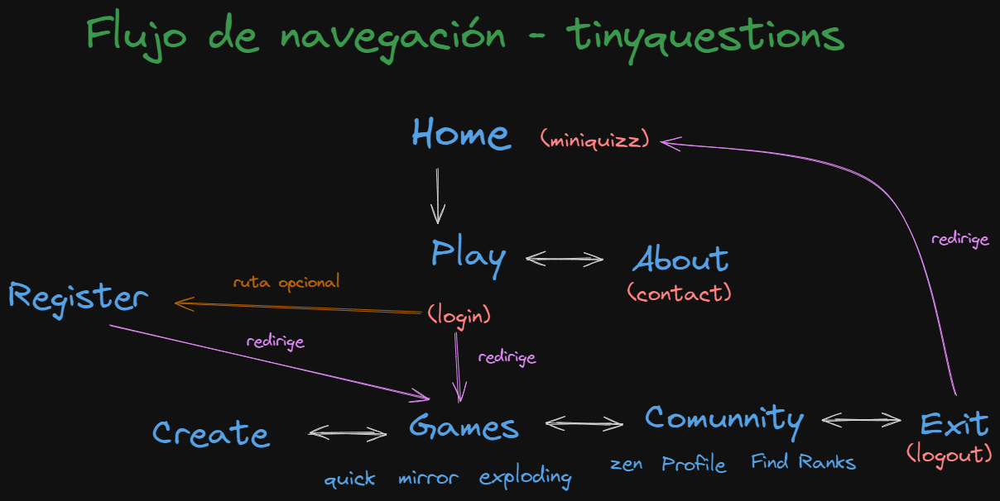

# tinyquestions
***
0 - Flujo de naveghación
=
***

***

1 - Documentación de ciertas funciones/tecnologías implementadas
=
***

### Validación de formularios - yup/Vee-validate

> Finalmente descarté el uso de la biblioteca **FormKit**
debido a que dejaba muy poca opción de personalización,
> lo cuál afectaba a mi diseño.
> Por tanto, como alternativa he usado:
> * *yup*: biblioteca de JS que permite realizar validaciones
> deforma cómoda y eficaz. 
> Ejemplo de uso:
> 
> Después de importar yup, podemos definir un objeto
> que guarda todas las validaciones que queramos.
> Vamos enlazando cada instancia de yup a las características
> de la validación (required, min, max, tipo de dato etc) y podemos
> pasar mensajes específicos para cada uno de ellos.

> el objeto esquema lo hemos creado para usarlo
> con la otra biblioteca.

> * *Vee-validate*: biblioteca para componetizar formularios
> y la lógica de validación de los mismos. Primero debemos importar
> los objetos a utilizar y luego los añadimos como
> componentes. Importante modificar el nombre, en este caso le he
> añadido una v delante, ya que así lo recomienda la biblioteca.
> 
> * Tras esto solo debemos llamar a nuestros componentes
> * en el template:
> * * Al objeto vForm le pasamos el esquema
> definido con yup
> * * A los campos, vField: el tipo de dato, el nombre (que debe
> corresponder con la propiedad del esquema correspondiente)
> *  * vError: solo necesita el nombre del input/validación
> correspondiente
       
> Y no haría falta nada más, los componentes 
> Vee-validate aplican toda la lógica necesaria (en este caso los condicionales
> para mostrar el mensaje de error o esconderlo y
> el cumplimiento de las normas por parte de los inputs del usuario)
> según el esquema creado con yup.
