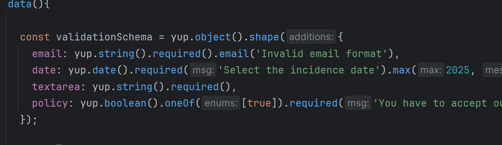

# tinyquestions
### *a web app of quick quizzes 🗯*

***

***

!!! - 쮺칩mo desplegar el proyecto en local?
=
***

![IMPORTANT]

### Primero desplegar el backend:

1 - Clonar el repositorio del backend:
> git clone https://github.com/Patcire/tinyquestions-backend.git

2 - En la terminal del proyecto:
> docker-compose up

### Ahora desplegamos el front:

1- Clonamos este repositorio:

> git clone https://github.com/Patcire/tinyquestions-frontend.git

2 - Abrimos el proyecto y en la terminal escribimos:

> npm install
> npm run dev

¡Y listo!

O si prefieres no ejecutar el frontend en local puedes hacerlo
desde la web desplegada (pero para las funcionalidades es necesario desplegar el backend en local)

> https://tinyquestions.netlify.app/#/

***

0 - Flujo de navegación
=
***

***

0.1 - Introducción
=
***

![IMPORTANT] 
> Para leer la documentación del proyecto al completo visitar el siguiente enlace:
> https://github.com/Patcire/tinyquestions-frontend/blob/main/doc/doc.md

Tinyquestions, estilizado tinyquestions, es una aplicación web que se enfoca en ofrecer a las usuarias y usuarios un enfoque rápido, accesible y minimalista de los clásicos juegos de trivial/quizzes.

Con ello se pretende ofrecer una herramienta altamente dinámica e interactiva con la que poder distraerse y liberar el estrés de la rutina diaria de forma fácil, sencilla y sin tener que dedicarle una gran cantidad de tiempo. A su vez, colateralmente, ofrece la oportunidad de adquirir nuevos datos y conocimientos.

El desarrollo del proyecto persigue por tanto la obtención de un producto final que pueda
servir de entretenimiento a un gran número de personas adaptando los juegos de preguntas y respuestas al formato filler games (juegos simples, cortos y con dinámicas fáciles de entender).

Por tanto, es prioritario el crear una web que sea cómoda y eficaz para los propósitos anteriormente descritos, otorgando por ello gran importancia al feedback que recibirán los usuarios y usuarias al interactuar con la UI y la inmediatez para poder estar jugando cuanto antes.

1 - Documentación de ciertas funciones/tecnologías implementadas
=
***

### Validación de formularios - yup/Vee-validate

> Finalmente descarté el uso de la biblioteca **FormKit**
debido a que dejaba muy poca opción de personalización,
> lo cuál afectaba a mi diseño.
> Por tanto, como alternativa he usado:
> * *yup*: biblioteca de JS que permite realizar validaciones
> deforma cómoda y eficaz. 
> Ejemplo de uso:
> 
> Después de importar yup, podemos definir un objeto
> que guarda todas las validaciones que queramos.
> Vamos enlazando cada instancia de yup a las características
> de la validación (required, min, max, tipo de dato etc) y podemos
> pasar mensajes específicos para cada uno de ellos.

> el objeto esquema lo hemos creado para usarlo
> con la otra biblioteca.

> * *Vee-validate*: biblioteca para componetizar formularios
> y la lógica de validación de los mismos. Primero debemos importar
> los objetos a utilizar y luego los añadimos como
> componentes. Importante modificar el nombre, en este caso le he
> añadido una v delante, ya que así lo recomienda la biblioteca.
> 
> * Tras esto solo debemos llamar a nuestros componentes
> * en el template:
> * * Al objeto vForm le pasamos el esquema
> definido con yup
> * * A los campos, vField: el tipo de dato, el nombre (que debe
> corresponder con la propiedad del esquema correspondiente)
> *  * vError: solo necesita el nombre del input/validación
> correspondiente
       
> Y no haría falta nada más, los componentes 
> Vee-validate aplican toda la lógica necesaria (en este caso los condicionales
> para mostrar el mensaje de error o esconderlo y
> el cumplimiento de las normas por parte de los inputs del usuario)
> según el esquema creado con yup.
