# tinyquestions
### *a web app of quick quizzes 🗯*

***
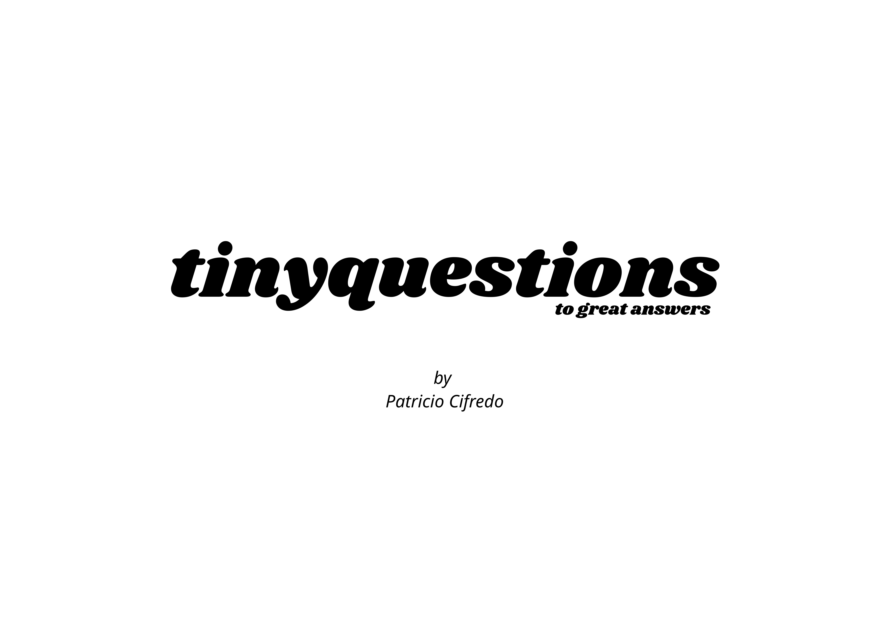
***

0 - Indice
=
***

1 - Introducción
=
***

Tinyquestions, estilizado tinyquestions, es una aplicación web que se enfoca en ofrecer a las usuarias y usuarios un enfoque rápido, accesible y minimalista de los clásicos juegos de trivial/quizzes.

Con ello se pretende ofrecer una herramienta altamente dinámica e interactiva con la que poder distraerse y liberar el estrés de la rutina diaria de forma fácil, sencilla y sin tener que dedicarle una gran cantidad de tiempo. A su vez, colateralmente, ofrece la oportunidad de adquirir nuevos datos y conocimientos.

El desarrollo del proyecto persigue por tanto la obtención de un producto final que pueda
servir de entretenimiento a un gran número de personas adaptando los juegos de preguntas y respuestas al formato filler games (juegos simples, cortos y con dinámicas fáciles de entender).

Por tanto, es prioritario el crear una web que sea cómoda y eficaz para los propósitos anteriormente descritos, otorgando por ello gran importancia al feedback que recibirán los usuarios y usuarias al interactuar con la UI y la inmediatez para poder estar jugando cuanto antes.

1.1 - Flujo de navegación de la app
=
***

1.2 - Diagrama ER y paso a tablas de la API
=
***
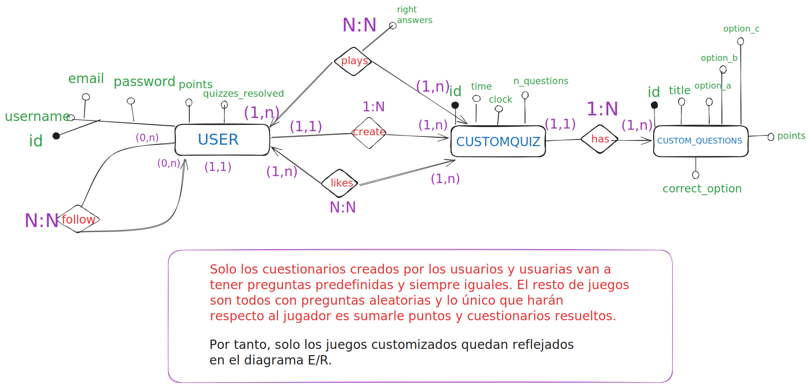
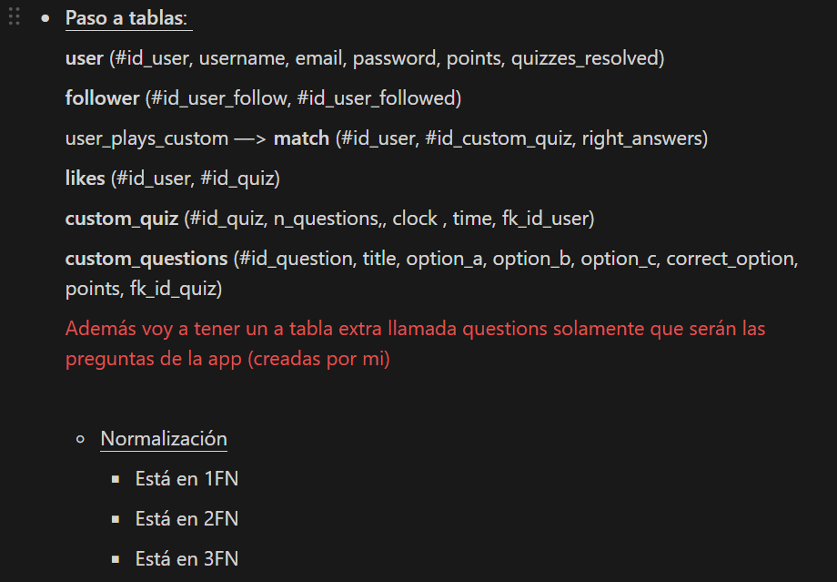

***

1.1 - Diseño - Guía de estilos y enlace a figma
=
***
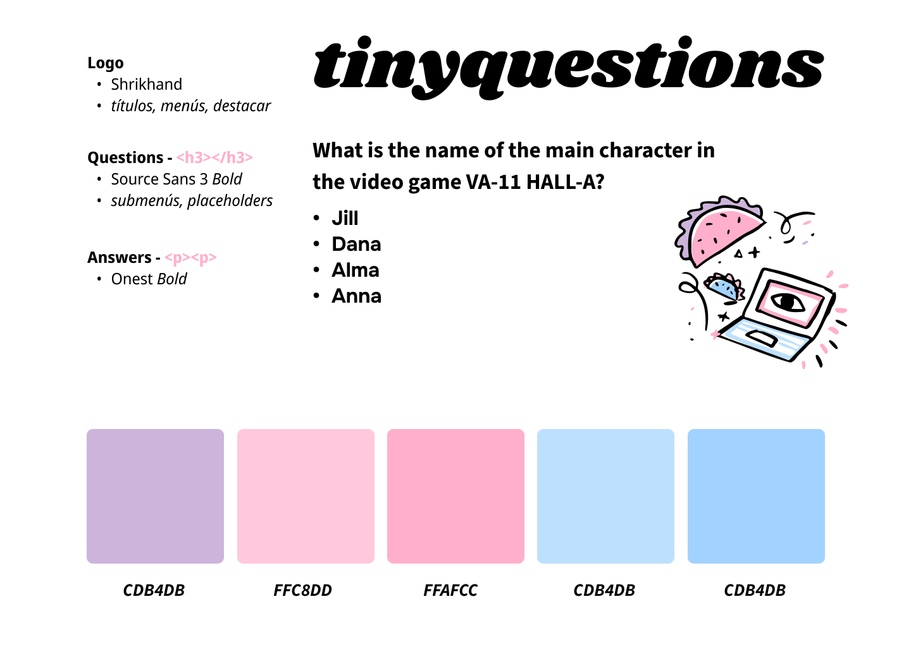

https://www.figma.com/file/VZp7N3ypV1xLI46HJJRahF/tinyquestions?type=design&node-id=11%3A5&mode=design&t=XkCPr6TotYh9neP6-1
***

1.3 - Funcionalidades: Expectativas VS Resultado Final (y Wireframes del diseño final)
=
***
### *Home (quiz de prueba)*
>Landing page con pequeño cuestionario
para que los usuarios/as pudiera probar la funcionalidad principal de la web:
los *quizzes*.

>> Entregado: ✔️

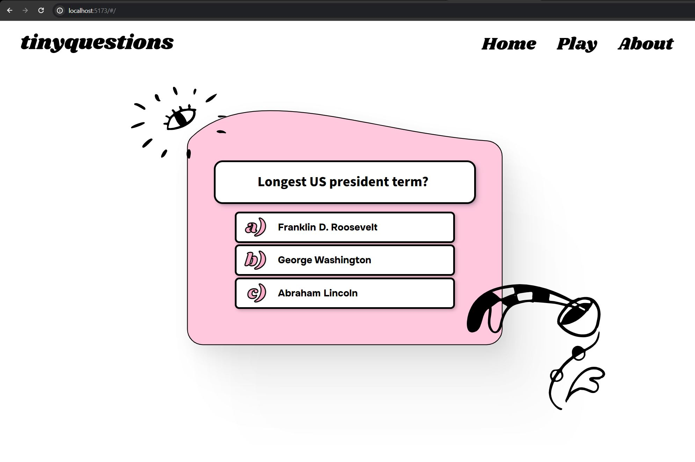

***

### *Login/Register*

> A través de formularios y en conjunción con la base de datos, se permitirá la creación de una cuenta en la que poder guardar el progreso de la usuario/o  y realizar una nueva serie de funcionalidades que veremos a continuación.

>> Entregado: ✔️

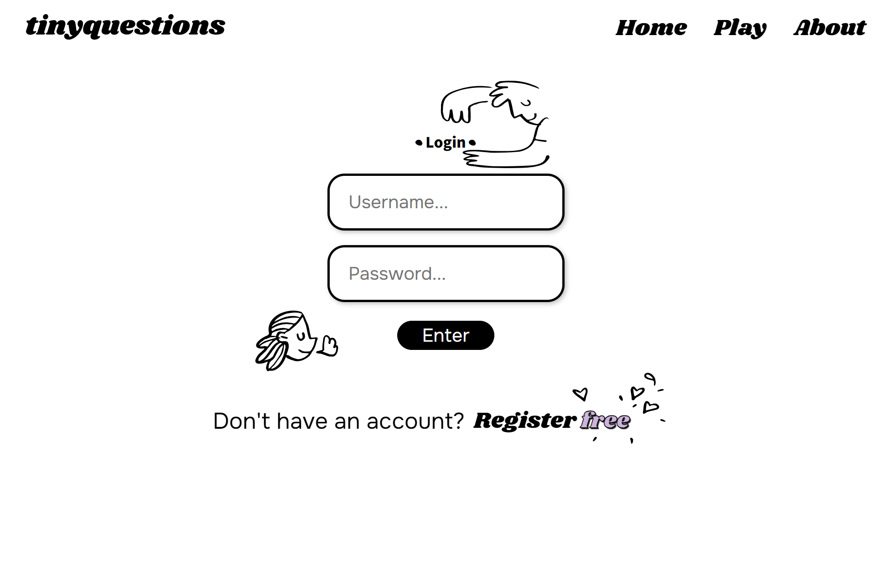
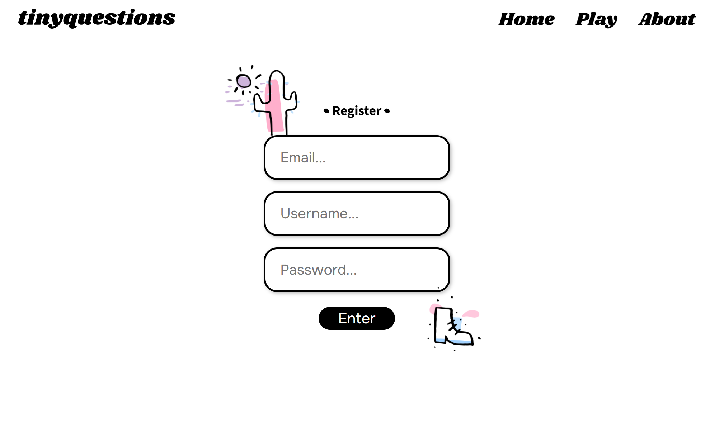

***
### *About (contacto)*

> Página con información sobre la web y la filosofía que sigue
> también permite mediante un botón, acceder a un cuestionario de contacto

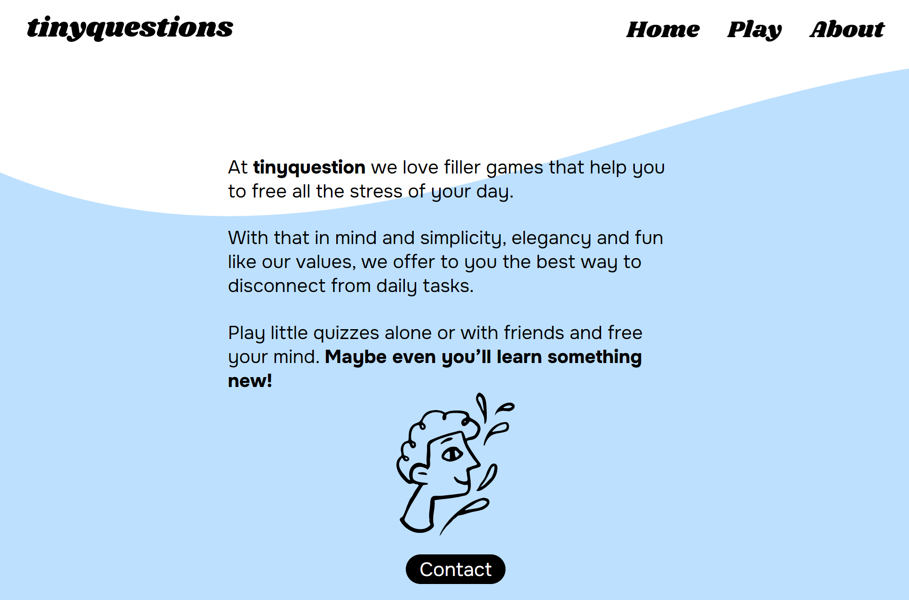

***

### *Games* 
>Las usuarias/os registrados podrán optar a una gran cantidad de preguntas y cuestionarios, 
> pudiéndose jugar a diversas modalidades a través de un  menú de selección. 

> **Nota**: Todos los cuestionarios serán generados de forma aleatoria a partir de una API propia.

> **Quick play**: Cuestionarios con 45s de duración para 12 preguntas. Intentar puntuar lo máximo posible.

>**Zen**: Modo infinito, sin tiempo y sin penalización por fallo. Para usuarias/os que quieren algo más relajante y sin competitividad.

>> Entregado: menú✔️ quick✔️ zen✔️ mirror❌ exploding❌

**Comentario al respecto**: De los 4 tipos juegos he podido implementar dos, ya que 
una vez terminados el modo quick y el zen he preferido optimizar el tiempo mejorando
otros aspectos de la web.

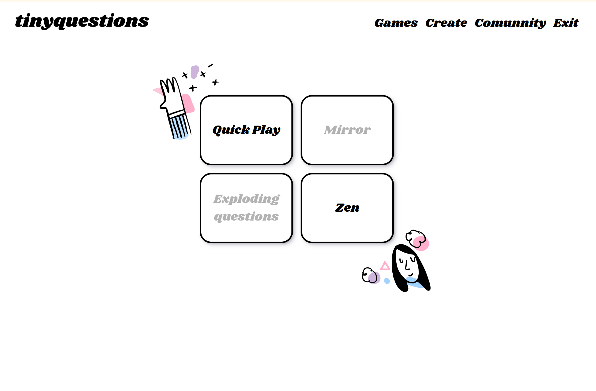
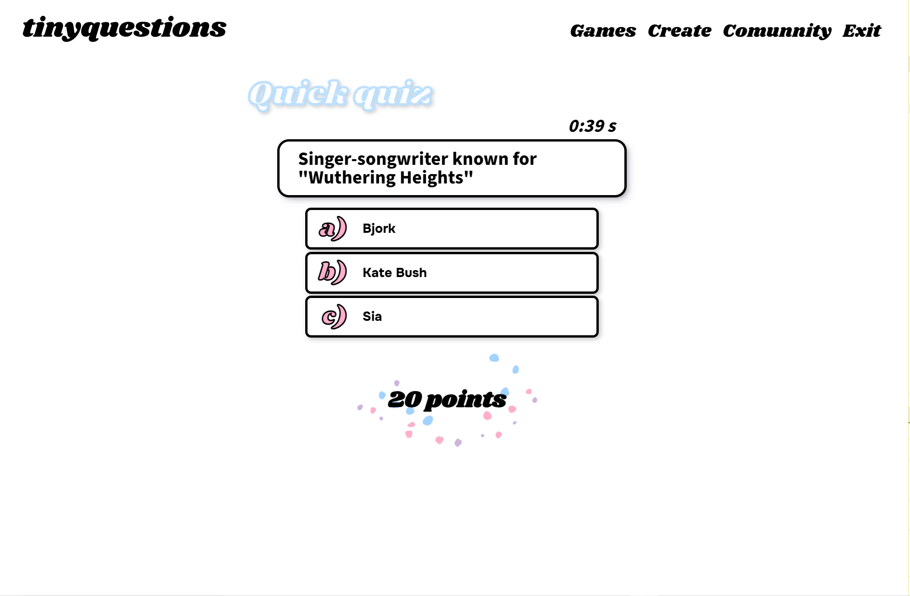
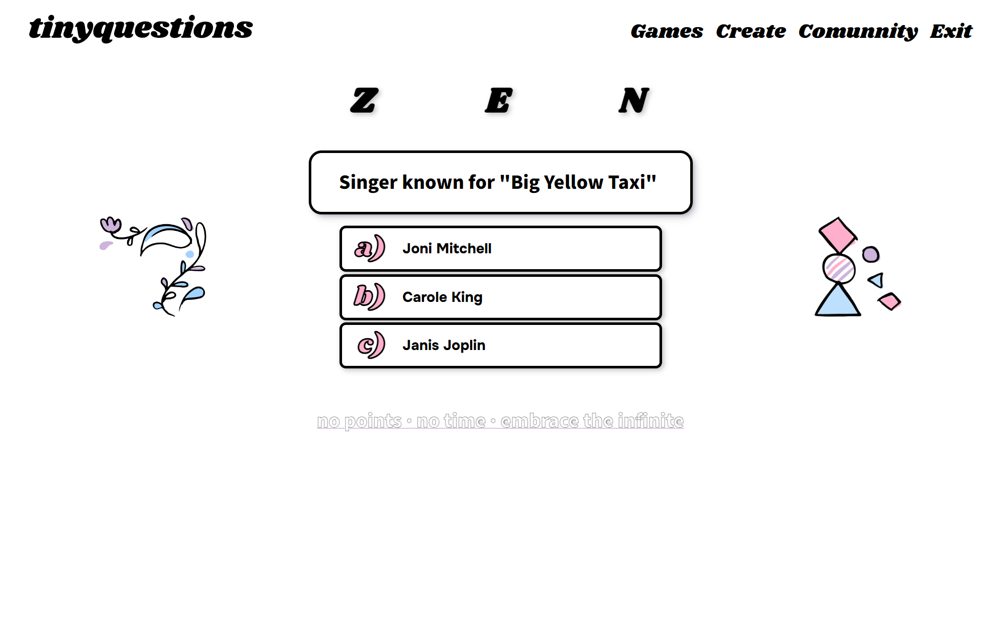

***

### *Create Mode*
> Mediante esta funcionalidad se podrán construir cuestionarios personalizados, 
> con preguntas y respuestas generadas por el usuario/a. 
> Este apartado de la web permite ser altamente interactivo, 
> pudiendo añadir preguntas o temporizador mediante botones, 
> y pudiendo ordenar la lista mediante drag&drop.

> entregado: ✔️ (lo único que no he podido implementar ha sido el drag & drop, probe varias bibliotecas
específicas para Vue pero no conseguí hacer funcionar ninguna)

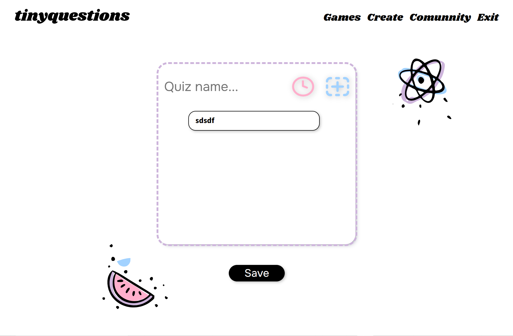

### *Community*

> La app cuenta con una sección donde la comunidad de jugadoras y jugadores podrán:
>Visitar su perfil: Que mostrará sus datos, un registro de su puntuación acumulada y del número de quizzes resueltos y una galería con sus cuestionarios personalizados.
>Investigar y jugar trivials creados por otros usuarios/as
>Ranks: Consultar una clasificación general de la base de usuarios/as en base a las puntuaciones registradas de cada una de las cuentas.

> Entregado: ✔️ (faltan las funcionalidades de rankings y que los usuarios puedan
> jugar los cuestionarios creados por otros usuarios.)
- Para poder aplicar que los usuarios pudieran jugar los cuestionarios 
personalizados necesitaba modificar un poco la lógica de funcionamiento de mi componente principal
**Quiz** y he decidido no implementarlo finalmente por motivos de tiempo, ya que con la inminente entrega
del proyecto quería evitar romper la app o perder tiempo que de otra forma
podía emplear en refinar lo ya implementado (y así ha sido).

>[!IMPORTANT]
> Por consideraciones de UX he decidido agrupar todas estas páginas
en una sola en la que se cambia la pestaña del contenido. 

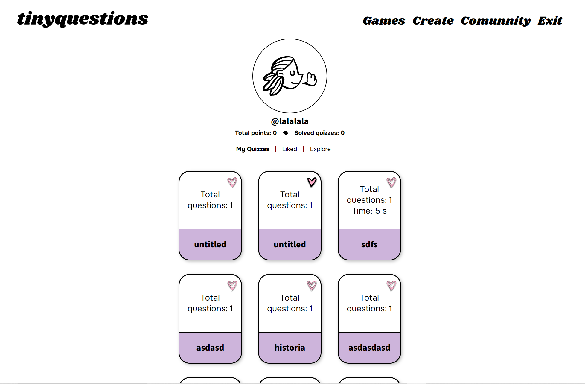

***

2 - Desarrollo y organización del proyecto
=
***

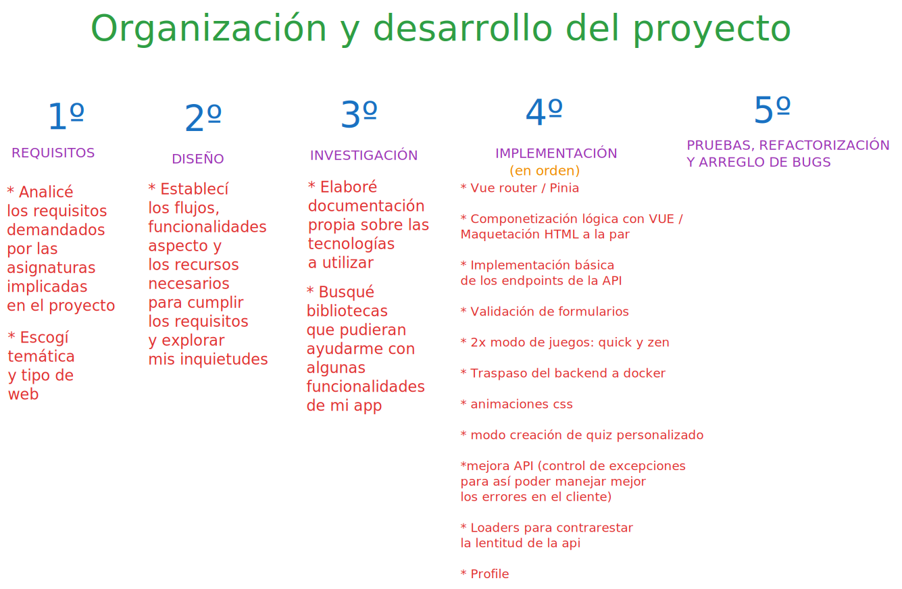
***
3 - Tecnologías utilizadas
=
***

* **VUE**: Framework de JS. Flexible y cómodo enfocado a las SPA reactivas. Ofrece dos 
 *modalidades*: la API de Opciones y la API Composition. Se ha utilizado la API de
opciones que ofrece una estructura menos funcional pero más organizada.

    Se ha complementado con:
  > **VueRouter**: Con un funcionamiento muy similar al React-DOM-Router. Es una biblioteca
    oifical del framework.

    > **Pinia**: Gestor de estados globales específico para VUE y que usurpó el puesto
    antes reinado por VUEX. Muy fácil de usar y configurar. Junto al plugin Pinia
    Persistante se puede conseguir una *hidratación* de las stores en el local storage.
    
    > **Vuedown**: librería que ofrece un componente importable de un countdown.
        Mediante props se le pasan parámetros como autostart, milisegundos de duración,
        restart etc. Aunque existían otras con más descargas en npm, me decanté por esta para
        implementar una cuenta regresiva de forma rápida y eficaz en 
        los modos de juego que así lo requerían ya que me pareción muy sencilla de configurar.
        https://fengyuanchen.github.io/vue-countdown/

    > **VeeValidate/Yup**:  
    -  *yup*: biblioteca de JS que permite realizar validaciones
                 deforma cómoda y eficaz.
                 Ejemplo de uso: 
                 Después de importar yup, podemos definir un objeto
                 que guarda todas las validaciones que queramos.
                 Vamos enlazando cada instancia de yup a las características
                 de la validación (required, min, max, tipo de dato etc) y podemos
                 pasar mensajes específicos para cada uno de ellos.
                 el objeto esquema lo hemos creado para usarlo
                 con la otra biblioteca.
       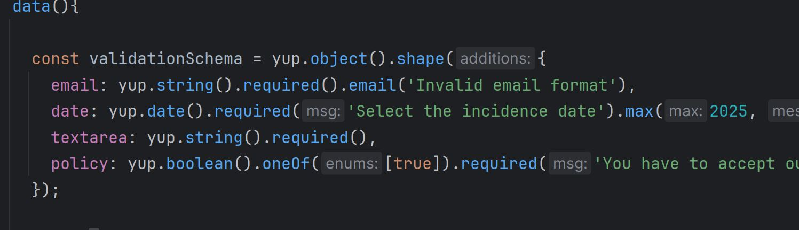
  
        
- *Vee-validate* : biblioteca para componetizar formularios
     y la lógica de validación de los mismos. Primero debemos importar
     los objetos a utilizar y luego los añadimos como
     componentes. Importante modificar el nombre, en este caso le he
     añadido una v delante, ya que así lo recomienda la biblioteca.
     
    Tras esto solo debemos llamar a nuestros componentes
    en el template:
    Al objeto vForm le pasamos el esquema
      definido con yup
    A los campos, vField: el tipo de dato, el nombre (que debe
      corresponder con la propiedad del esquema correspondiente)
    vError: solo necesita el nombre del input/validación
  correspondiente
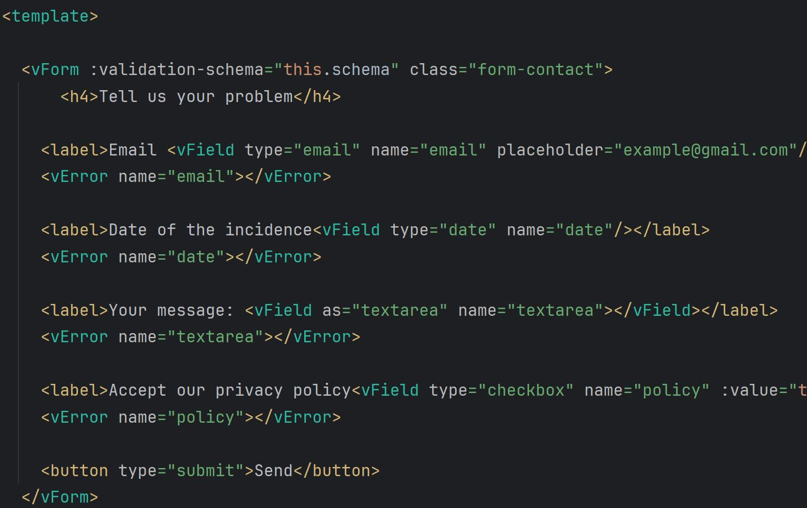
  Y no haría falta nada más, los componentes
  Vee-validate aplican toda la lógica necesaria (en este caso los condicionales
  para mostrar el mensaje de error o esconderlo y
  el cumplimiento de las normas por parte de los inputs del usuario)
  según el esquema creado con yup.

* SASS: He usado este precompilador de CSS para manejar los estilos de mi web.
He acabado gratamente contento de haberme decidio a usarlo ya que aunque por temas de
tiempo solo lo vimos en clase unas pequeñas pinceladas, me ha permitido una buena
organización de mi estructura de archivos de estilos y además cuenta con algunas
funcionalidades muy útiles como las variables, las funciones y el nesting.

Todo ello junto a una metodología **BEM** me ha permitido una gran organización
a la par que una gran experiencia de desarrollo.

* **Laravel**: Framework de PHP que permite crear una API REST con poca sintaxis/verbosidad
y muy escalable. Lo que menos me ha gustado es su sistema de migraciones/seeders
  (que directamente he ignorado) y la configuración necesaria para que me funcionase en docker.

* **Figma**: Aplicación especializada en el diseño web. Ofrece muchas herramientas
para poder preparar los mock-ups y los wireframes de nuestra app.

* **Excalidraw**: Aplicación web para crear diagramas con cierto toque "manual"
 con el que he desarrollado mis diagramas de flujos y otras figuras empleadas
 en esta documentación.

* **Notion**: Web de planificación y documentación (similar a Obsidian)
en la que he desarrollado mis documentaciones propias y he ido
estableciendo los distintos objetivos del trabajo.

* Y por supuesto **git** para el control de versiones y **github** para el almacenamiento
remoto del código.

***

4 - Diseño: Validación, Dark Mode, y Accesibilidad 
=
***

-Para garantizar la calidad y el estándar del código CSS hemos procedido 
a pasar su validación en https://jigsaw.w3.org/css-validator/ :

-Respecto al Dark Mode, no ha sido finalmente implementado, ya que aunque lo he empezado a implementar
no iba a poder entregarlo al 100% y tampoco con una estructura de código correcta.

Dejo un par de fotos del intento de implementación y el objetivo de establecerlo
para la versión del proyecto final (PFG). Al lado de explore estaba
el icono que permitía realizar el cambio a modo oscuro.

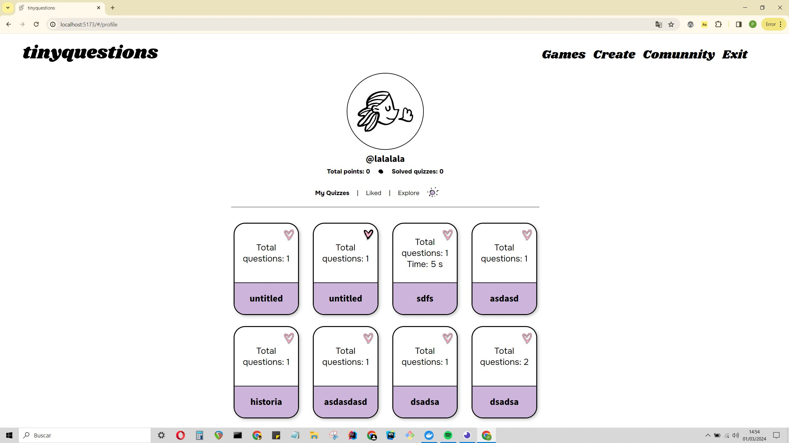
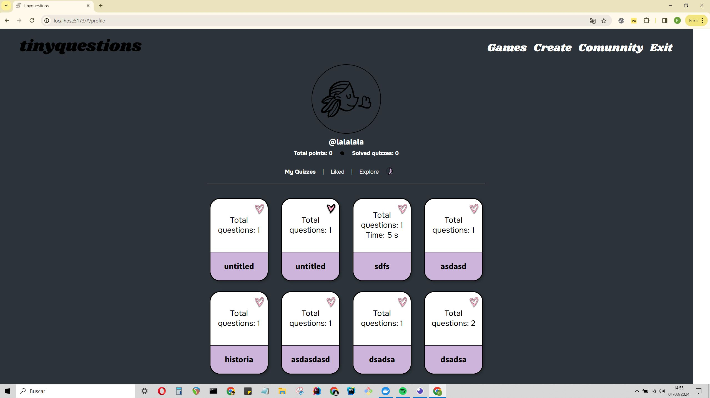

-En cuanto a la accesibilidad, como primer filtro
he procedido a usar la extensión de chrome **wave** , 
con la cuál corregí algunos errores tales como:

* la falta de aria label en el checkbox que se esconde
tras el icono del menú hamburguesa del modo móvil.

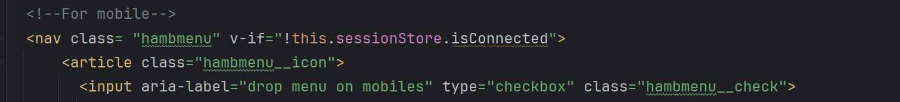

* Me faltaba un v-if en la etiqueta header, por tanto,
si no había título (elemento h1) el header se me quedaba vacío
y eso lo detectaba como un error. Versión corregida:
  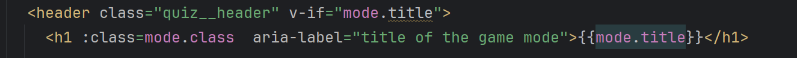

Fui corrigiendo estos errores hasta obtener un 0 en todas las urls.
Aun así, en algunos casos la extensión me ha marcado
algunos elementos decorativos como error de contraste
ya que la paleta de colores pastel tenía un contraste bajo.
Por ejemplo: 

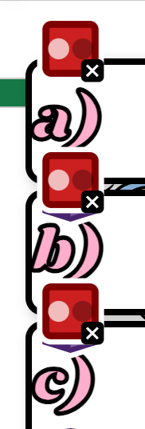

Debido a que en el código ese eelemento solo es decorativo y no
afecta a la accesibilidad de los quizzes he considerado que no es necesario
un cambio de color (que afectaría a la paleta escogida). Aun así,
he decidido añadir un aria label para explicar de qué se trata.

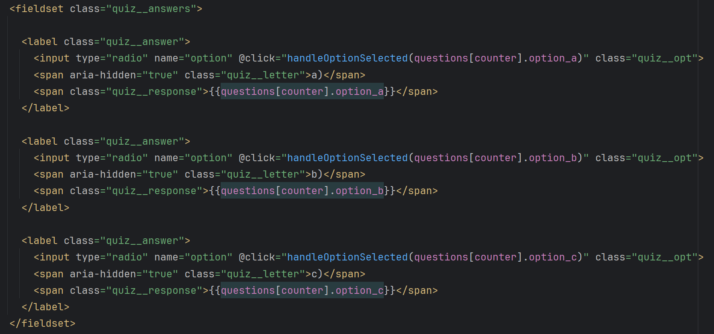

Finalmente, presento el informe TAW de mi app:

5 - Reflexiones finales del trabajo
=
***

En retrospectiva este proyecto ha sido una monmtaña rusa de 
emociones, momentos donde todo fluía y otros en los que
me he dado golpes con un muro una y otra vez. 

El hecho de ser un proyecto compartido por 4 asignaturas
ha supuesto un reto altamente gratificante en mi experiencia
como desarrollador y en el desarrollo de mi aprendizaje.
La alta organización y planificación que ha requerido,
la constante necesidad de adaptarme a nuevas tecnologías
que he tenido que aprender "sobre la marcha" y a su vez la aplicación
de conocimientos, patrones y esquemas adquiridos previamente durante el curso
me hace entregar este proyecto con un producto, que aunque no exento
de mejoras y fallos, con el cuál estoy satisfecho y contento.

Aun así, la interdisciplinaridad también conlleva sus desventajas,
y el trabajar con entregas que se pisaban unas a otras
o en las cuáles en algunos momentos necesitaba de alguna
parte de otra asignatura todavía no implementada para la entrega de otra
ha supuesto algunos "cuellos de botella" en mi planificación. El estar
trabajando varios días seguidos en una de las partes de mi app
para luego dejarla completamente de lado una semana porque necesito
apretar en otra área debido a alguna entrega ha supuesto algunos picos
de estrés, que aunque no incapacitantes, si lastran un poco la experiencia
de desarrollo de un proyecto tan completo e interesante como
el que nos habéis propuesto.

A pesar de ello, valoro muy positivamente la experiencia y todo
lo aprendido supera con creces esos pèqueños agobios que he comentado.
Me voy con la sensación de haber hecho un trabajo acorde a lo solicitado,
y que me ha servido para demostrarme que poseo las capacidades
necesarias (adaptación, búsqueda de pastrones comúnes, 
uso de nuevas tecnologías y organización)
para afrontar el largo camino laboral y de aprendizaje
que me espera como desarrollador web.

Por último, me gustaría añadir que desde el inicio de este proyecto
he estado muy emocionado por el tipo de app que he estado haciendo, 
ya que la idea de ofrecer una web  de quizzes, que me podría imaginar usando
más allá de mi rol como desarrollador, me hace querer ampliar
sus límites y mejorarla con la idea de llevar este producto a un nivel superior
convirtiéndolo en mi Proyecto de Fin de Grado.

Espero poder contar con la aprobación del departamento para tal fin y poder establecer
con ustedes los objetivos/requisitos necesarios para poder seguir trabajando en este proyecto.

